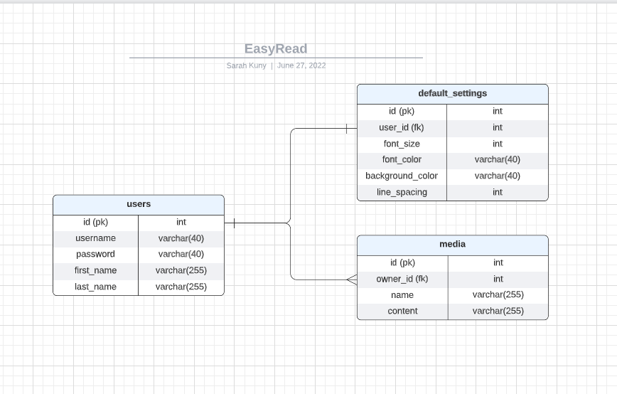

# EasyRead

## Architecture

## Front-End

### User Flow Diagram


## Back-End

### Database Schema



## Setup

### Dependencies

- BACKEND: Run 'npm install' in project directory.
- FRONTEND: 'cd client' and run 'npm install'

### Database Prep

- Access the MySQL interface in your terminal by running 'mysql -u root -p'
- Create a new database called easyread: 'create database easyread;'
- Add a '.env' file to the project directory containing MySQL authentication, for example:

```bash
  DB_HOST=127.0.0.1
  DB_USER=root
  DB_NAME=easyread
  DB_PASS=YOURPASSWORD
```

- In a new terminal: in the project directory run 'npm run migrate' to create tables within the easyread database
- To view structure of tables, in MySQL console:

  - 'use easyread;'
  - 'describe users'

- In a new terminal, install the following packages in the backend:

### Development

- BACKEND TERMINAL: in project directory run 'npm start' (runs on port 5000)
- FRONTEND TERMINAL: 'cd client' then 'npm start' (runs on port 3000)
